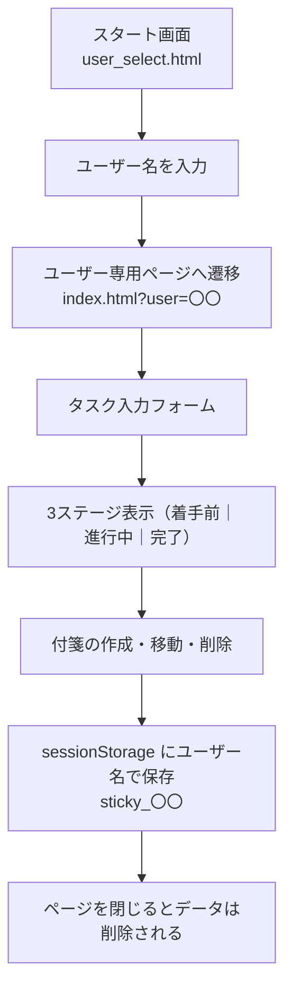

```mermaid
graph TD

A[スタート画面<br>user_select.html]
B[ユーザー名を入力]
C[ユーザー専用ページへ遷移<br>index.html?user=〇〇]
D[タスク入力フォーム]
E[3ステージ表示（着手前｜進行中｜完了）]
F[付箋の作成・移動・削除]
G[sessionStorage にユーザー名で保存<br>sticky_〇〇]
H[ページを閉じるとデータは削除される]


A --> B
B --> C
C --> D
D --> E
E --> F
F --> G
G --> H 


```